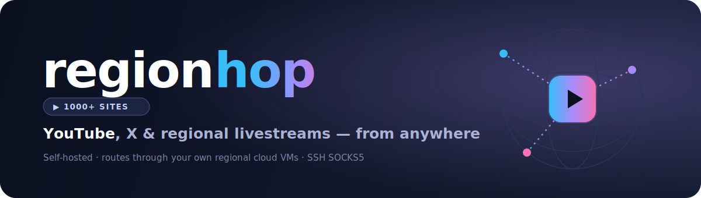
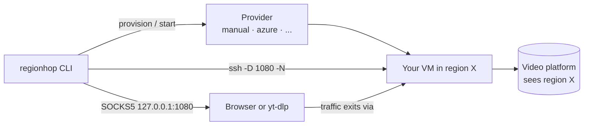

<p align="center">
  
</p>

<p align="center">
  <a href="https://github.com/Akshay-Dagar/regionhop/actions/workflows/ci.yml"></a>
  
  
  
</p>

# regionhop

**Watch region-locked Youtube, X or other videos — including livestreams — by routing through your own regional cloud VMs.**

Stream or download region-locked video from **1,000+ sites** — **YouTube**, **X** (Twitter), Twitch, Vimeo, regional broadcasters, and more — by routing through your regional cloud VMs.

`regionhop` is a small, self-hosted CLI. You bring your own cloud VM in the
region you want to appear from; it brings up an SSH SOCKS5 tunnel to that VM,
verifies the exit country, and plays the video through it — either in a real
browser (best for livestreams) or via [`yt-dlp`](https://github.com/yt-dlp/yt-dlp)
(best for downloading/recording).

> [!IMPORTANT]
> **Read [DISCLAIMER.md](DISCLAIMER.md).** This is a personal, self-hosted tool.
> It is **not** a hosted service, is **not** affiliated with YouTube/Google, and
> ships **no** ability to access anything you couldn't reach yourself from a VM
> you own. Bypassing regional restrictions may violate a platform's Terms of
> Service or local law — that is your responsibility.

---

## How it works



1. A **provider** makes sure a VM exists and is running in your chosen region.
2. `regionhop` opens an **SSH SOCKS5 tunnel** to it (`127.0.0.1:1080`).
3. It **verifies** the exit country through the tunnel.
4. It launches a **browser** (routed through the proxy) or **yt-dlp** on your URL.

## Requirements

- **Python 3.11+**
- **OpenSSH client** (`ssh`) on your PATH — ships with modern Windows, macOS, Linux
- A **Chromium-based browser** (Chrome/Chromium/Brave/Edge) for `--player browser`
- Optional: **yt-dlp** (and **mpv**/**ffplay**) for `--player yt-dlp`
- Optional: **Azure CLI** (`az`) for the managed `azure` provider

## Install

```bash
pip install regionhop            # from PyPI (once published)
# or with pipx (isolated):        pipx install regionhop
# or from source:
git clone https://github.com/Akshay-Dagar/regionhop && cd regionhop
pip install -e .
```

## Quickstart

```bash
pip install regionhop

# First run walks you through setup, then plays:
regionhop watch "https://www.youtube.com/live/XXXXXXXXXXX"
```

On first run, `regionhop` asks for your VM (host, SSH user, key), saves the
config, brings up the tunnel, verifies the exit country, and opens the stream.
After that, watching is a single command.

**Zero-config one-liner** — pass the VM inline, no config file needed:

```bash
regionhop watch "https://youtu.be/XXXX" \
  --host 203.0.113.10 --user azureuser --key ~/.ssh/id_ed25519
```

Re-run the wizard any time to add regions: `regionhop setup`.

## Commands

| Command | What it does |
|---|---|
| `regionhop setup` | Interactive wizard — create/add a region (no hand-editing TOML). |
| `regionhop watch <url> [-r region]` | Watch through a region. **First run auto-runs setup.** `--player browser` (default) or `yt-dlp`; ad-hoc `--host/--user/--key`. |
| `regionhop up [-r region]` | Start (and verify) the tunnel for a region. |
| `regionhop status [-r region]` | Show VM + tunnel status. |
| `regionhop down [-r region]` | Stop the tunnel. Add `--deallocate` (stop billing) or `--destroy` (delete VM). |
| `regionhop regions` | List configured regions. |
| `regionhop init [path]` | Write an example config file to edit by hand. |

Useful `watch` flags: `--player yt-dlp`, `--download`, `--quality 720`,
`--cookies-from-browser chrome` (helps yt-dlp past datacenter bot checks).

## Configuration

TOML, searched in this order: `--config`, `$REGIONHOP_CONFIG`, `./regionhop.toml`,
`~/.config/regionhop/config.toml`.

```toml
default_region = "br"

# Bring your own VM — you manage its lifecycle.
[regions.br]
provider = "manual"
host = "203.0.113.10"
user = "azureuser"
key_path = "~/.ssh/id_ed25519_br"   # recommended
# password = "s3cr3t"               # OR plaintext password instead of a key (less secure)
local_port = 1080

# Or let regionhop manage an Azure VM for you (needs `az login`).
[regions.jp]
provider = "azure"
resource_group = "regionhop-jp"
name = "rh-jp"
location = "japaneast"
ssh_public_key_path = "~/.ssh/id_ed25519_br.pub"
key_path = "~/.ssh/id_ed25519_br"
local_port = 1081
```

See [`examples/config.example.toml`](examples/config.example.toml).

**Authentication.** Use `key_path` (recommended) **or** a `password`. Password
auth is fed to `ssh` through a throwaway `SSH_ASKPASS` helper (the password is
passed by environment variable, never written to that helper file) — but it is
stored **in plaintext in your config file**, so keep it private (on Linux/macOS
regionhop restricts it to `600`). SSH keys are safer.

## Providers

| Provider | Manages VM lifecycle? | Needs |
|---|---|---|
| `manual` | No — you create/start/stop it | any VM + SSH key |
| `azure` | Yes — create/start/deallocate/destroy | Azure CLI (`az login`) |

Adding a provider is a single small class — see [CONTRIBUTING.md](CONTRIBUTING.md).

## Roadmap

- More providers (GCP, AWS, DigitalOcean, Hetzner, Vultr)
- Auto-deallocate on idle to control cost
- Cookie / PO-token handling for `yt-dlp` on flagged IPs
- Optional local web UI

## Contributing

PRs welcome — see [CONTRIBUTING.md](CONTRIBUTING.md) and
[CODE_OF_CONDUCT.md](CODE_OF_CONDUCT.md).

## License

[MIT](LICENSE) © The regionhop Authors
